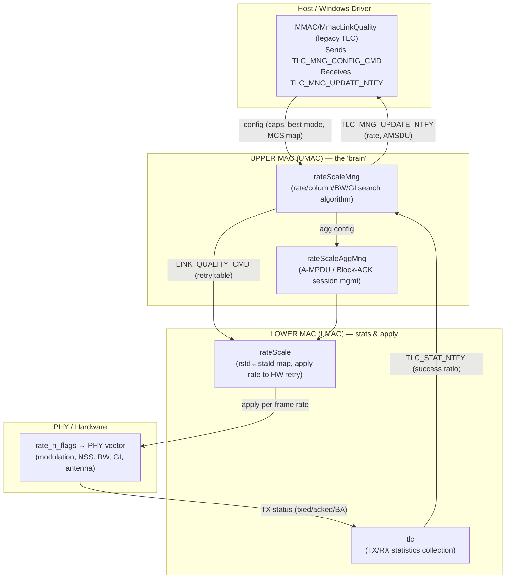
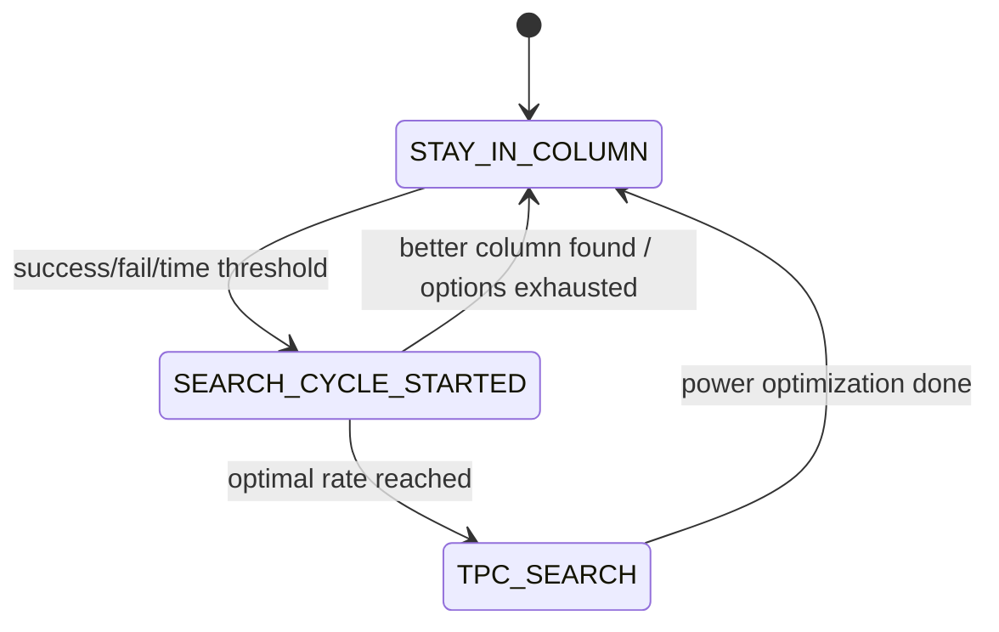

# TLC (Transmit Link Control) — Hierarchy & Functionality

TLC (a.k.a. **Rate Scale Manager**, "TLC Offload") is the firmware rate-adaptation engine.
It continuously measures link quality and picks the best PHY/MAC transmission
parameters (rate, bandwidth, GI, spatial streams, aggregation, power) to maximize
throughput while keeping the link reliable.

The logic is split across three firmware layers plus the host driver, and mirrored by
dedicated **simulation** units used in software (USFSTL) testing.

---

## 1. Layered Hierarchy

**Flow in one sentence:** the driver configures TLC → UMAC decides the rate table →
LMAC applies it to hardware and gathers TX statistics → statistics feed back to the
UMAC algorithm, which re-optimizes and notifies the driver.

---

## 2. Units & Responsibilities

### 2.1 Upper MAC (UMAC) — decision algorithm
Location: `fw/src/umac/main/dataPath/rateScaleMng/`

| File | Responsibility |
|------|----------------|
| `rateScaleMng.c` / `.h` | Core rate-adaptation algorithm: state machine, column search, up/down-scale, TPC, expected-throughput tables |
| `_rateScaleMng.h` | Internal types: `RS_MNG_STA_INFO_S`, columns, retry-table sizing, statistics windows |
| `rateScaleAggMng.c` / `.h` | Block-ACK / A-MPDU session management (ADDBA/DELBA, window size, agg factor) |
| `rateScaleMng_static.c` | Static rate tables (expected throughput, columns, XVT fixed-rate path) |

Key functions:
- `tlcStatUpdateHandler()` — consumes success/failure statistics from LMAC.
- `cmdHandlerTlcConfigInUmac()` — handles `TLC_MNG_CONFIG_CMD` from the driver.
- `rsMngTpcSetRequest()` / `rsMngTpcClearRequest()` — Transmit Power Control.
- `tlcMngHandleDhcCmd()` — debug/host-command hooks (fixed rate, fixed AMSDU, etc.).

### 2.2 Lower MAC (LMAC) — statistics & rate apply
Location: `fw/src/lmac/mcm/core/dataPath/`

| File | Responsibility |
|------|----------------|
| `rateScale/rateScale.c` / `.h` | Maps station↔rateScaleId (`rsId`), applies the chosen rate into the HW retry table (`rateScaleApply`), aggregation-allowed decision |
| `tlc/tlc.c` / `tlc.h` | Collects per-station TX statistics (`tlcUpdateStat`), AMSDU BA sliding-window, sends `TLC_STAT_NTFY` up to UMAC (`tlcSendStat`) |

Key functions:
- `rateScaleApply()` — writes the per-frame rate/retry into `MAC_INTERNAL_DATA_DATAPATH_S`.
- `rateScaleUpdate()` — accumulates txed/acked/BA per frame.
- `tlcUpdateStat()` / `tlcSendStat()` — build & push statistics notification.
- `rateScaleGetIndex()` — current retry index (falls back to HW retry count in stub build).

### 2.3 PHY / Hardware
The UMAC output rate is encoded as **`RATE_MCS_API_U` (`rate_n_flags`)**, a bitfield that
the PHY consumes directly. It carries: modulation (CCK/OFDM/HT/VHT/HE/EHT/UHR), MCS,
NSS (SISO/MIMO), bandwidth, guard interval, antenna mask, STBC, LDPC, DCM, LTF.
Rate/BW/GI/antenna capabilities are validated against `RS_RATE_ERROR_E`.

### 2.4 Host / Driver
Location: `wifi_drv-dev/drv/win_driver/Win_Driver/MMAC/MmacLinkQuality/` (legacy) and
`DataPath/DataPathTlcConfig/DataPathTlcConfig.c`.
The driver sends station capabilities via `TLC_MNG_CONFIG_CMD_API_S` and consumes
`TLC_MNG_UPDATE_NTFY_API_S` (initial rate + AMSDU updates).

### 2.5 Simulation units (software test framework)
Location: `fw/tests/softwareTesting/`

| Sim file | Emulates |
|----------|----------|
| `.../umac/libs/host/usimLibTlc.c` | **Host side**: send `TLC_MNG_CONFIG_CMD`, set fixed rate, DHC, read back rate/AMSDU notifications, path-loss/SNR sweeps (`usimLibTlcPathLossChange`, `usimLibTlcGetTptBasedOnSnr`) |
| `.../umac/libs/lmacSim/usimLibLmacTlc.c` | **LMAC→UMAC**: fabricate TX statistics (`usimLibLmacTlcUpdateStatistics[BasedOnSnr]`), model path-loss→rate→TPT, capture the `LINK_QUALITY` command UMAC produces (`usimLibLmacTlcWaitForLqCmd`) |
| `.../lmac/libs/lsimLibTlc.c` | **LMAC LQ config**: inject a `STATION_TX_LINK_QUALITY_S` (fixed rate table) into LMAC |
| `.../projects/usim/umacSimTlc/umacSimTlcUTest.c` | End-to-end UMAC TLC unit tests (per-mode configs, fixed rate, TPC, AMSDU, aggregation) |
| `.../projects/usim/umacSimTlcStatic/umacSimTlcStaticUTest.c` | Static-table / XVT-mapping tests |

---

## 3. TLC Inputs (what drives the decision)

Statistics are gathered in LMAC (`tlc.c`) per Block-ACK response and pushed to UMAC.

| Input | Where | Meaning / use |
|-------|-------|---------------|
| **txed / acked** | `tlcUpdateStat`, `rateScaleUpdate` | Raw transmitted vs. acknowledged frame counts (per BA) |
| **Success Ratio (SR)** | `RS_MNG_WIN_STAT_S.successRatio` | `acked / txed`, scaled to `RS_MNG_SR_DENOMINATOR` (BIT(15)=32768). Primary decision metric |
| **PER (Packet Error Rate)** | derived = `1 − SR` | Failure fraction; `FAIL_RATIO_POWER` thresholds trigger downscale |
| **Average TPT** | `RS_MNG_WIN_STAT_S.averageTpt` | `SR × expectedTpt` — compares candidate rates/columns |
| **Success / Fail frame counters** | `totalFramesSuccess`, `totalFramesFailed` | Trigger a search cycle (non-legacy 4500 succ / 400 fail; legacy 480 / 160) |
| **Timestamps** | `lastStatisticUpdate`, `lastUpdate` | Stale-data protection; 10 s idle forces re-evaluation |
| **RSSI / SNR** | `RS_MNG_RSSI_DATA_S` (from beacon) | Start point selection, TPC gating |
| **BA / AMSDU window** | `TLC_AMSDU_STAT_S` | AMSDU enable/disable thresholds (SR ≥ 94% enable, ≤ 50% disable) |
| **TB (trigger-based) stats** | `TLC_TB_STAT_S` | UL OFDMA / trigger-based rate control |
| **PBO / SAR / thermal** | PBO notif, `rsMngTpcSetRequest` | Power limits that cap the usable rate set |

Thresholds (see `_rateScaleMng.h`): `RS_MNG_PERFECT_SR = 95%`,
`RS_MNG_SR_NO_DECREASE = 90%`, `RS_MNG_SR_FORCE_DECREASE = 15%`.

---

## 4. TLC Outputs (what TLC produces)

The UMAC algorithm emits a **`LINK_QUALITY_CMD_API_S`** (the "retry table") to LMAC, plus a
**`TLC_MNG_UPDATE_NTFY`** to the driver.

| Output | Field / type | Description |
|--------|--------------|-------------|
| **Primary rate** | `rate_scale_table[0..1]` | Current optimal rate (initial rate, 2 retries) |
| **Retry table** | `rate_scale_table[LINK_QUAL_MAX_RETRY_NUM]` | Full fallback ladder: primary (0-2) → secondary MCS-1 (3-4) → tertiary MCS-2 (5) → SISO/legacy fallbacks (6-15). Each entry is a `rate_n_flags` |
| **Bandwidth (BW)** | encoded in `rate_n_flags` / `searchBw` | 20/40/80/160/320 MHz chosen per column search |
| **Guard Interval (GI)** | `RS_MNG_GI_E` in `rate_n_flags` | NGI/SGI (HT/VHT) or 3.2/1.6/0.8 µs (HE/EHT) |
| **NSS / column** | `RS_MNG_COLUMN_DESC_E`, `mimo_delimiter` | SISO/MIMO/STBC + antenna (A/B/AB) configuration |
| **Reduced TX power** | `txReducedPower`, `allowedPowerDrop` | TPC back-off (dB) while keeping the link |
| **Antenna mask** | `preferred_ant_msk` | Best single/dual antenna for the primary rate |
| **RTS protection** | `rtsBitMsk` | Which table rates use RTS/CTS |
| **Aggregation params** | `LINK_QUAL_AGG_PARAMS_API_S` | `uAggTimeLim`, `uAggFrameCntLim`, agg start/disable thresholds |
| **AMSDU enable** | `TLC_MNG_UPDATE_NTFY` → `amsduSize`, `amsduEnabledTids` | Max A-MSDU size + TIDs allowed |
| **Initial rate notif** | `TLC_MNG_UPDATE_NTFY` → `rate` | Rate reported back to the driver |

---

## 5. Input Parameters — Deep Dive

For every input: **origin** (where the value comes from), **refresh rate** (how often it
is recomputed), and whether it is **actually used** by the decision logic.

### 5.1 txed / acked (transmitted vs. acknowledged frames)
- **Origin:** LMAC (`tlc.c`, `rateScaleUpdate`) counts frames per Block-ACK response from HW.
- **Refresh:** accumulated every BA; pushed to UMAC as `TLC_STAT_NTFY` once `txed` exceeds the
  per-station threshold (`RS_STAT_THOLD = 20`, or the "test window" / "optimal" counts below).
- **Used?** Yes — the raw material for every other metric. Not used directly for decisions.

### 5.2 Success Ratio (SR)
- **Origin:** UMAC `_rsMngCollectTlcData()` → `SR = 32768 × successes / attempts`, then passed
  through a **time-weighted EWMA** (`_rsMngEwmaLookUp`): `SR = ewma[Δt]·(new−old)/256 + old`.
- **Refresh:** recomputed on each statistics notification (every ≥20 frames in a test window,
  every ≥2000 frames when locked on the optimal rate to save power/CPU).
- **Typical values:** 0–32768 (0–100%). Steady link ≈ 90–95%+.
- **Used?** Yes — the **primary** decision metric (upscale/downscale, column compare, TPC, AMSDU).

### 5.3 PER (Packet Error Rate)
- **Origin:** derived, `PER = 1 − SR` (failure fraction). `FAIL_RATIO_POWER` frames the
  force-decrease boundary.
- **Refresh:** same cadence as SR.
- **Used?** Yes — implicitly, via the SR thresholds (`RS_MNG_SR_FORCE_DECREASE = 15%`,
  `RS_MNG_SR_NO_DECREASE = 90%`).

### 5.4 Average Throughput (averageTpt)
- **Origin:** `averageTpt = SR × expectedTpt / 32768`, where `expectedTpt` comes from static
  per-mode tables (`expectedTptNonHt`, `expectedTptHtVht[bw][gi][nss]`, `expectedTptHe[...]`),
  in units of Mbps × 10. An aggregation factor (`_rsMngCalcAggFactor`) is applied first.
- **Refresh:** same cadence as SR.
- **Used?** Yes — the value used to **compare** the current column vs. a candidate column.

### 5.5 Success / Fail frame counters (totals)
- **Origin:** `RS_MNG_STA_INFO_S.totalFramesSuccess / totalFramesFailed` accumulated in UMAC.
- **Refresh:** every statistics update; reset when a search cycle starts.
- **Used?** Yes — trigger a search cycle (non-legacy: 4500 success / 400 fail; legacy: 480 / 160).

### 5.6 Timestamps (lastStatisticUpdate, win.lastUpdate)
- **Origin:** `systemTimeGet()` at each update.
- **Refresh:** every statistics update.
- **Used?** Yes — EWMA weighting, stale-data protection, and the ~10 s idle "flush" that forces
  re-evaluation without traffic.

### 5.7 RSSI / SNR
- **Origin:** `RS_MNG_RSSI_DATA_S` filled from `MAIN_BEACON_DATA_NTFY_S` (beacon RX);
  the simulator models it via path-loss (`usimLibLmacTlcSetPathLoss`).
- **Refresh:** on each beacon (~100 ms in typical infra), 10 s time resolution kept.
- **Used?** Yes but **secondary** — start-rate selection and TPC gating; TLC is fundamentally
  SR-driven, not SNR-driven.

### 5.8 Block-ACK / AMSDU window
- **Origin:** `TLC_AMSDU_STAT_S` sliding window over the last 8 BA responses (LMAC `tlc.c`).
- **Refresh:** per BA.
- **Used?** Yes — AMSDU enable (SR ≥ 94%) / disable (SR ≤ 50%) and A-MSDU size selection.

### 5.9 Trigger-Based (TB) statistics
- **Origin:** `TLC_TB_STAT_S` for UL-OFDMA / trigger-based TX.
- **Refresh:** per TB response; windows `RS_MNG_TB_MCS_WIN_US = 300 ms`, `RS_MNG_TB_WIN_US = 1 s`.
- **Used?** Yes — only when the station transmits trigger-based (UL MU); separate rate path.

### 5.10 PBO / SAR / Thermal power limits
- **Origin:** PBO notifications (`rsMngPboStatusChange`), BT-SAR (`tlcMngBtSarTxPowerLimitUpdate`),
  thermal (`rsMngTpcSetRequest(RS_MNG_TPC_REQ_THERMAL)`).
- **Refresh:** event-driven; SAR manager throttled to ≥1 s between updates.
- **Used?** Yes — cap the usable rate/antenna set and drive TPC back-off.

---

## 6. Output Parameters — Deep Dive

For every output: **how it is calculated**, **when it is active**, **typical values**, and
**design considerations**.

### 6.1 Primary rate (`rate_scale_table[0..1]`)
- **Calculation:** the current column's chosen MCS/NSS/BW/GI encoded as `rate_n_flags`.
  Selected as the rate whose `averageTpt` is highest and whose SR passes the no-decrease
  threshold. `RS_MNG_RETRY_TABLE_INITIAL_RATE_NUM = 2` entries hold it.
- **When active:** always — it is the first thing HW attempts for every MPDU/A-MPDU.
- **Typical:** in good conditions the highest supported MCS (e.g. HE/EHT MCS 9–13, MIMO, 0.8 µs GI).
- **Considerations:** upscaled at most every `RS_MNG_UPSCALE_MAX_FREQUENCY = 200 ms`; guarded by
  `avoidHigherMcs` for 1 s after an SR collapse from perfect to <70%.

### 6.2 Retry table (`rate_scale_table[LINK_QUAL_MAX_RETRY_NUM]`)
- **Calculation:** a descending ladder built around the primary: primary (idx 0–2) →
  secondary MCS−1 (3–4) → tertiary MCS−2 (5) → SISO/legacy fallbacks (6–15). Each entry is a
  full `rate_n_flags`. `RS_MNG_RETRY_TABLE_MAX_HT_LOW_IDX = 13`, `..._NON_HT_LOW_IDX = 14`.
- **When active:** entry *N* is used only if all attempts on entries `< N` failed for that frame.
- **Typical:** ~16 entries; last entries are robust legacy OFDM/CCK.
- **Considerations:** the ladder guarantees a frame still gets out under sudden fading before the
  next algorithm cycle can react.

### 6.3 Bandwidth (BW)
- **Calculation:** chosen during column/BW search (`searchBw`), clamped to `min(peer, maxChWidth,
  g_rsMng.dbg.maxBw, puncLimit)`; encoded in `rate_n_flags`.
- **When active:** applies to every frame at the selected rate; narrowing may occur under
  puncturing or 2-antenna power mitigation.
- **Typical:** 20 / 40 / 80 / 160 / 320 MHz (`TLC_MNG_CH_WIDTH_*`).
- **Considerations:** wider BW = more TPT but more susceptible to interference; TLC only widens
  after validating throughput at the narrower width.

### 6.4 Guard Interval (GI)
- **Calculation:** a column attribute (`RS_MNG_GI_E`). HT/VHT: NGI/SGI (subject to
  `sgiChWidthSupport`); HE/EHT: 3.2 / 1.6 / 0.8 µs.
- **When active:** part of the active column; tested during column search.
- **Typical:** 0.8 µs at high SR (max TPT), 3.2 µs when robustness is needed.
- **Considerations:** shorter GI raises TPT but is less tolerant to delay spread; some APs block
  2× LTF (`TLC_MNG_CONFIG_FLAGS_HE_BLOCK_2X_LTF_MSK`).

### 6.5 NSS / column (SISO/MIMO/STBC + antenna)
- **Calculation:** `RS_MNG_COLUMN_DESC_E` selected via the column-search graph (`nextCols`,
  `checks`); `mimo_delimiter` marks the SISO/MIMO boundary in the table; `preferred_ant_msk`
  is the best single antenna.
- **When active:** MIMO only when SR and power headroom allow; STBC used for diversity at low SR.
- **Typical:** MIMO 2-stream in strong links; SISO/STBC at the cell edge.
- **Considerations:** MIMO limited by 2-antenna power cap (`RS_MNG_2A_MITIGATE_S`); BT coex may
  force SISO.

### 6.6 Reduced TX power / TPC (`txReducedPower`, `allowedPowerDrop`)
- **Calculation:** TPC search reduces power in `tpcPwrBoStepSize` (default 2 dB) steps while SR
  stays above `tpcSrDecrease` (95%); increases back-off when SR ≥ `tpcSrIncrease` (98%);
  force-disables (step 0) when SR ≤ `tpcSrForceDisable` (10%). Range −10 … +24 dBm.
- **When active:** only at the **optimal** rate, **not** in a search cycle, non-legacy, and only
  after A-MSDU has been active ≥ 500 ms; else `RS_MNG_TPC_DISABLED`.
- **Typical:** 0–several dB of back-off; larger when thermally/SAR constrained.
- **Considerations:** saves power & reduces self-interference without hurting TPT; disabled by
  `TLC_MNG_DEBUG_TPC_ENABLED = 0`.

### 6.7 Antenna mask (`preferred_ant_msk`)
- **Calculation:** best single/dual antenna per band from `g_rsMngPreferredAntDb`.
- **When active:** for SISO rates and control frames.
- **Typical:** chain A, chain B, or A+B (CDD).
- **Considerations:** balanced against power caps and coex.

### 6.8 RTS protection (`rtsBitMsk`)
- **Calculation:** bitmask of table rates that must use RTS/CTS; forced during test windows.
- **When active:** unless `g_rsMng.dbg.rtsDisable` (and not a test window).
- **Typical:** protection on higher/aggregated rates.
- **Considerations:** trades airtime for collision protection.

### 6.9 Aggregation params (`LINK_QUAL_AGG_PARAMS_API_S`)
- **Calculation:** `uAggFrameCntLim` = per-mode max (HT/VHT 64, HE 256, EHT 512/1024);
  `uAggTimeLim` from `RS_MNG_AGG_DURATION_LIMIT` (5400 µs) or debug override; `uAggDisStartTh`
  = retry index above which aggregation is not started.
- **When active:** once a Block-ACK session is established (`rateScaleAggMng`).
- **Typical:** 64–256 frames, ≤ 5.4 ms TXOP.
- **Considerations:** larger aggregates raise TPT but increase latency and BT-coex impact.

### 6.10 A-MSDU enable/size (`TLC_MNG_UPDATE_NTFY.amsduSize / amsduEnabledTids`)
- **Calculation:** enabled when SR ≥ `RS_MNG_AMSDU_SR_ENABLE_THRESHOLD` (94%); disabled at
  ≤ 50%; size chosen from the `amsduSz` step table; only on agg-session, non-low-latency TIDs
  (`RS_MNG_AMSDU_VALID_TIDS_MSK = 0xF`).
- **When active:** high-SR, aggregating stations; blacklisted after consecutive AMSDU failures.
- **Typical:** 3.5–11 KB per A-MSDU.
- **Considerations:** big efficiency gain at high SR; harmful at low SR (whole A-MSDU lost on
  error) — hence the strict SR gate.

### 6.11 Initial-rate notification (`TLC_MNG_UPDATE_NTFY.rate`)
- **Calculation:** mirror of the primary rate, sent to the driver when it changes
  (`TLC_MNG_NOTIF_FLAG_RATE`).
- **When active:** only if the driver requested notifications (`TLC_MNG_NOTIF_REQ_CMD`).
- **Considerations:** informational for the host; the actual TX rate lives in the LMAC table.

---

## 7. Configuration & Tunable Knobs

What you can control in the TLC algorithm, grouped by mechanism.

### 7.1 Station configuration — `TLC_MNG_CONFIG_CMD` (from the driver)
Sent once per station at association; defines the **capability envelope** TLC operates within.

| Field | Controls |
|-------|----------|
| `maxChWidth` | Max bandwidth (20…320 MHz) |
| `bestSuppMode` | Highest PHY mode (Legacy/HT/VHT/HE/EHT/UHR) |
| `chainsEnabled` | Antenna chains (A/B) → SISO vs. MIMO possibility |
| `sgiChWidthSupport` | SGI allowed per bandwidth (HT/VHT) |
| `configFlags` | STBC, LDPC, HE-DCM, EHT-DUP, 2×LTF block, ELR |
| `nonHt` | Bitmap of allowed CCK/OFDM legacy rates |
| `mcs[nss][bw]` | Per-NSS/per-BW supported MCS bitmap |
| `maxMpduLen` | Drives max A-MSDU size (0 = AMSDU off) |
| `maxTxOp` | TXOP cap for all ACs (0 = no limit) |

### 7.2 Runtime debug hooks — `TLC_MNG_DEBUG_CMD` / DHC (`TLC_MNG_DEBUG_TYPES_E`)
Per-station, live overrides (`DHC_INT_UMAC_TLC_DEBUG_CONFIG`):

| Type | Effect |
|------|--------|
| `TLC_MNG_DEBUG_FIXED_RATE` | Force a fixed `rate_n_flags` (0 = back to auto) |
| `TLC_MNG_DEBUG_PARTIAL_FIXED_RATE` | Fix some rate fields, let TLC scale the rest |
| `TLC_MNG_DEBUG_AGG_DURATION_LIM` | A-MPDU duration limit (100–8000 µs) |
| `TLC_MNG_DEBUG_AGG_FRAME_CNT_LIM` | A-MPDU frame count (1–64) |
| `TLC_MNG_DEBUG_TPC_ENABLED` | Enable/disable TPC (default on) |
| `TLC_MNG_DEBUG_TPC_STATS` | Return per-TPC-step frame histogram |
| `TLC_MNG_DEBUG_RTS_DISABLE` | Disable RTS protection |
| `TLC_MNG_DEBUG_FAST_START` | Start at max configured PHY rate (WFA tests) |

Internal-only (`TLC_MNG_INTERNAL_DEBUG_TYPES_E`, ≥ 128): `MAX_BW`, `AGG_CONTROL`,
`AGG_F_THRESH`, `2ANT_LIMIT`, `FAST_START`, `FIXED_AMSDU`, `BT_SAR_DICTATE_MODE`.

### 7.3 TPC configuration — `TPC_CONFIG_S`
| Field | Default | Meaning |
|-------|---------|---------|
| `tpcEnabled` | Auto | 0 Auto / 1 Force-off / 2 Force-on |
| `tpcSrIncrease` | 98% | SR to step **up** power back-off |
| `tpcSrDecrease` | 95% | SR to step **down** power back-off |
| `tpcSrForceDisable` | 10% | SR to jump back to full power (step 0) |
| `tpcPwrBoStepSize` | 2 dB | Back-off step |
| `tpcSearchCycleExtraBo` | 2 dB | Extra back-off during search |

### 7.4 Global debug state — `g_rsMng.dbg`
`fastStart`, `rtsDisable`, `amsdu.size`, `amsdu.tids`, `maxBw`, `durationLimit`, `sarValue`.

### 7.5 Compile-time algorithm constants (`_rateScaleMng.h`)
The core "personality" of the algorithm — change requires a firmware rebuild.

| Constant | Value | Role |
|----------|-------|------|
| `RS_MNG_PERFECT_SR` | 95% | "perfect" link threshold |
| `RS_MNG_SR_NO_DECREASE` | 90% | above this, never downscale |
| `RS_MNG_SR_FORCE_DECREASE` | 15% | below this, force downscale |
| `RS_STAT_THOLD` | 20 | frames per stats notification (normal) |
| `RS_MNG_UPSCALE_AGG_FRAME_COUNT` | 20 | frames in a test window |
| `RS_MNG_SHORT_AGG_FRAME_COUNT` | 10 | frames in fast-start window |
| `RS_MNG_OPTIMAL_RATE_FRAME_COUNT` | 2000 | frames between checks at optimal rate |
| `RS_MNG_UPSCALE_MAX_FREQUENCY` | 200 ms | min time between upscale attempts |
| `RS_MNG_UPSCALE_SEARCH_CYCLE_MAX_FREQ` | 300 ms | min time between search cycles |
| `RS_MNG_AMSDU_SR_ENABLE/DISABLE_THRESHOLD` | 94% / 50% | AMSDU gating |
| `RS_MNG_AGG_DURATION_LIMIT` | 5400 µs | default A-MPDU duration |
| `RS_MNG_EWMA_DENOMINATOR` | 256 | SR smoothing resolution |

---

## 8. Rate-Scale State Machine

- **STAY_IN_COLUMN** — steady state on a proven rate; actions `STAY / UPSCALE / DOWNSCALE`.
- **SEARCH_CYCLE_STARTED** — probe alternative columns (NSS, GI, STBC, BW) and compare
  `averageTpt`; `visitedColumns` tracks tested columns.
- **TPC_SEARCH** — once at the optimal rate, test power reduction (`RS_MNG_TPC_TBL_S`).

Search-cycle entry conditions (`RS_MNG_SEARCH_CYCLE_START_REASON_E`): success frames,
success time, fail frames, or flush/idle time.

---

## 9. Quick File Map

| Layer | Path |
|-------|------|
| UMAC algorithm | `wcd_fw-dev/fw/src/umac/main/dataPath/rateScaleMng/` |
| LMAC apply | `wcd_fw-dev/fw/src/lmac/mcm/core/dataPath/rateScale/` |
| LMAC statistics | `wcd_fw-dev/fw/src/lmac/mcm/core/dataPath/tlc/` |
| API (config/notif) | `wcd_fw-dev/fw/inc/commands/apiGroupDatapath.h` |
| API (LQ/retry table) | `wcd_fw-dev/fw/src/shared/inc/apiLmacUmac.h`, `stationDefines.h` |
| Host sim | `.../softwareTesting/supportingModules/src/flow/umac/libs/host/usimLibTlc.c` |
| LMAC sim | `.../softwareTesting/supportingModules/src/flow/umac/libs/lmacSim/usimLibLmacTlc.c` |
| LMAC LQ sim | `.../softwareTesting/supportingModules/src/flow/lmac/libs/lsimLibTlc.c` |
| UMAC tests | `.../softwareTesting/projects/usim/umacSimTlc/umacSimTlcUTest.c` |
| Driver config | `wifi_drv-dev/drv/win_driver/Win_Driver/DataPath/DataPathTlcConfig/DataPathTlcConfig.c` |
| Driver legacy TLC | `wifi_drv-dev/drv/win_driver/Win_Driver/MMAC/MmacLinkQuality/` |
